## {transition=zoom autoslide=5000 style="text-align: center;"}

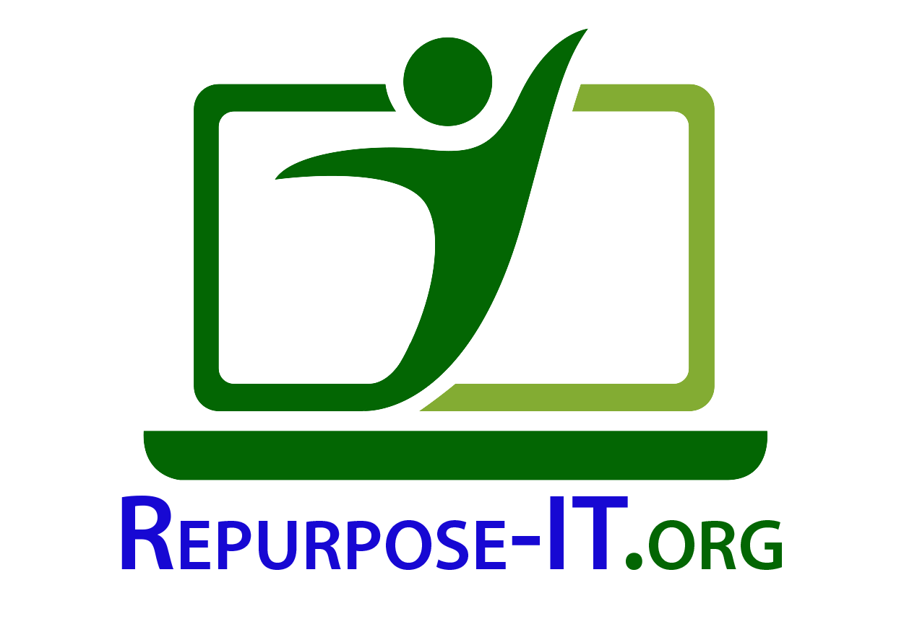

## {auto-animate=true autoslide=4000}

<stamp class="r-fit-text"> Technology - Education - Culture </stamp>

## {auto-animate=true autoslide=4000}

<stamp class="r-fit-text"> Tecnología - Educación - Cultura </stamp>

<stamp class="r-fit-text"> Technology - Education - Culture </stamp>

## {auto-animate=true autoslide=4000}

<stamp class="r-fit-text"> Seynachʉ gúnkʉnʉ - Riwiamʉ - Kunsamʉ bunachʉ </stamp>

<stamp class="r-fit-text"> Tecnología - Educación - Cultura </stamp>

<stamp class="r-fit-text"> Technology - Education - Culture </stamp>

## {auto-animate=true}

<stamp class="r-fit-text"> Khĩirjũg - Khʉd - Joobanʉm </stamp>

<stamp class="r-fit-text"> Seynachʉ gúnkʉnʉ - Riwiamʉ - Kunsamʉ bunachʉ </stamp>

<stamp class="r-fit-text"> Tecnología - Educación - Cultura </stamp>

<stamp class="r-fit-text"> Technology - Education - Culture </stamp>

## Tecnología {transition="zoom" style="text-align:center"} 

::: {.r-stack .slideshow}

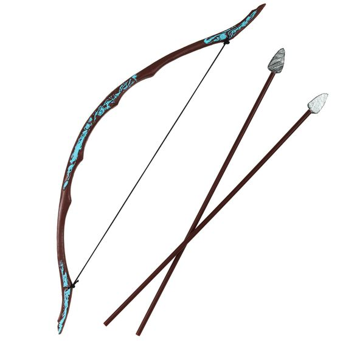

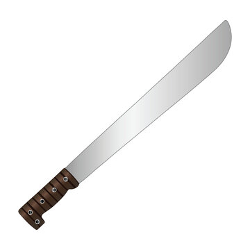{.fragment .fade-up}

{.fragment .fade-right}

{.fragment .fade-left}

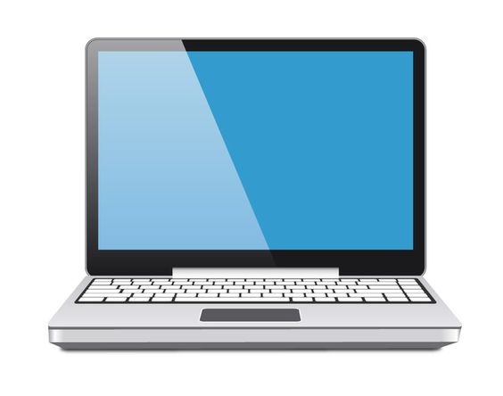{.fragment .fade-down}

:::

## {.center background-color="#000000"}



---

::: {.column}
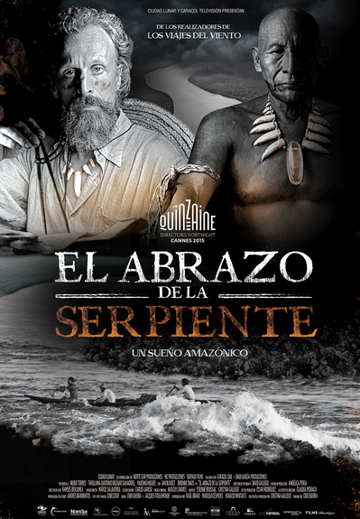{.center}
:::
::: {.column}
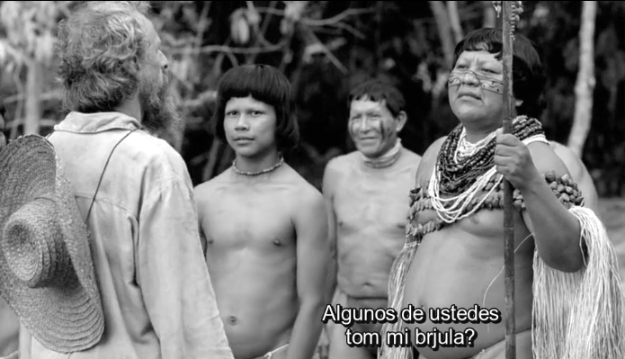{height="100%" width="auto"}

::: {.card}
<stamp> ¿Quién decide qué puedo hacer con la tecnología? </stamp>
:::

:::

---

## Conquistadores Digitales {style="text-align:center" transition="slide"}

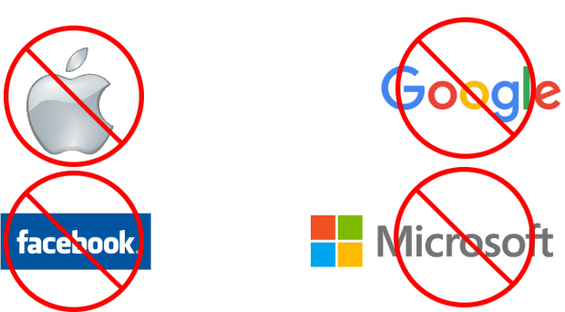{.r-stretch}

::: {.fragment .fade-up}
<stamp class="r-fit-text">La tecnología nos puede *liberar*   pero también nos puede *esclavizar*.</stamp>
:::

---

<h1> <green>Existen alternativas</green> </h1>

<h2> Que respetan nuestra <green>**Soberanía Tecnológica**</green></h2>

::: {.column}

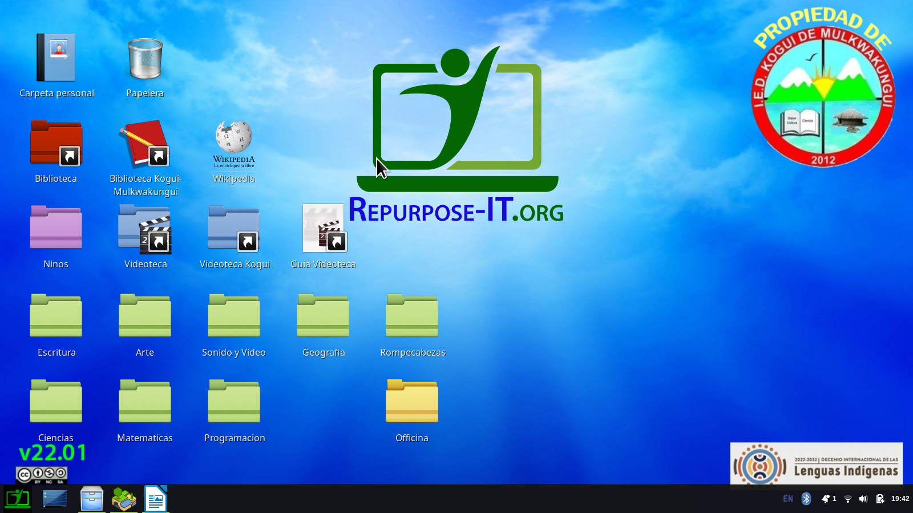{height="380px"}

:::

::: {.column}

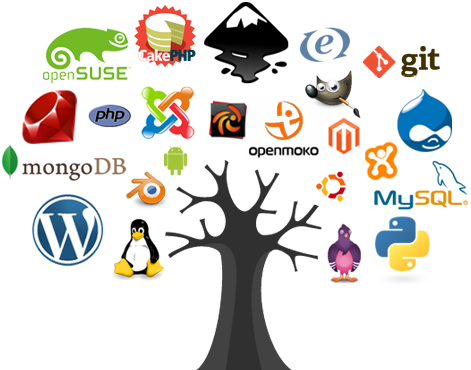

:::

# ¿Dónde está   <red>la línea roja</red>?

# Software Libre {transition="zoom" style="text-align:center"}

::: {.card .incremental}
* <green>Libertad 0</green>: Usar para cualquier propósito
* <green>Libertad 1</green>: Estudiar y modificar
* <green>Libertad 2</green>: Compartir con otros
* <green>Libertad 3</green>: Compartir mejoras
:::

---

::: { .card }
<h2> La computadora es una extensión de la mente </h2>
¿Quién decide lo que puedo pensar?
:::
 

::: {.column}
{height="400px"}
:::

::: {.column}

::: {.card .incremental}
* Memoria
* Análisis
* Comunicación
* Automatización
* Mucho más...
:::

:::

---

::: {.card }
* <green>Libertad 0</green>: Usar para cualquier propósito
* <green>Libertad 1</green>: Estudiar y modificar
* <green>Libertad 2</green>: Compartir con otros
* <green>Libertad 3</green>: Compartir mejoras
:::

 

::: {.card}
El Software Libre nace de un **profundo respeto** por las personas.

Es un movimiento <green>**ético y político**</green> - <red>no tecnológico</red>.
:::

# Solo la tecnología <green>*libre*</green> &nbsp; garantiza nuestra <green>*Soberanía Tecnológica*</green>

---

::: {.column}

<h2>Para crear  nuestra propia</h2>

<h1><green>*cultura digital*</green></h1>

:::

::: {.column}

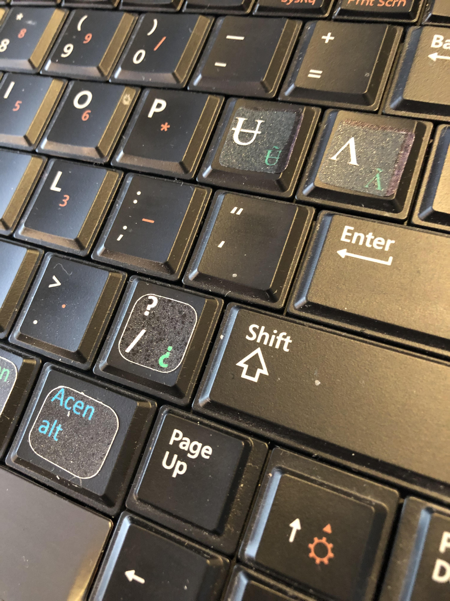

:::

##   <green>*Soberanía*</green> - no solo tecnología

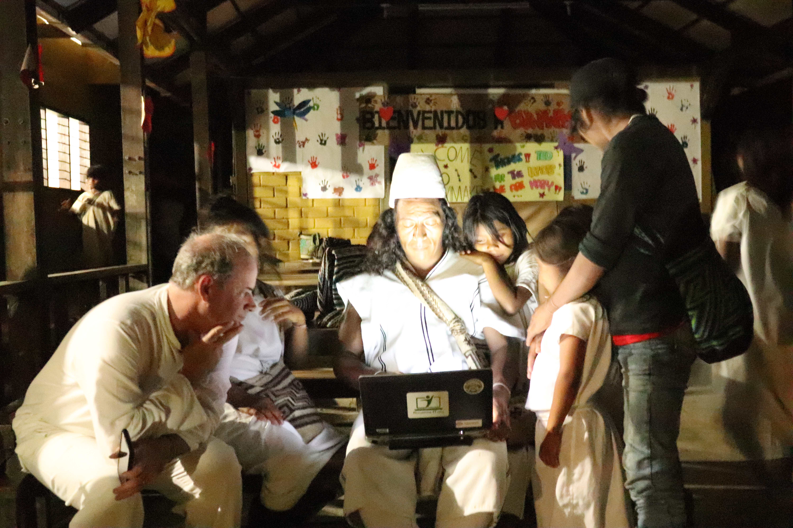

## {autoslide=4000}

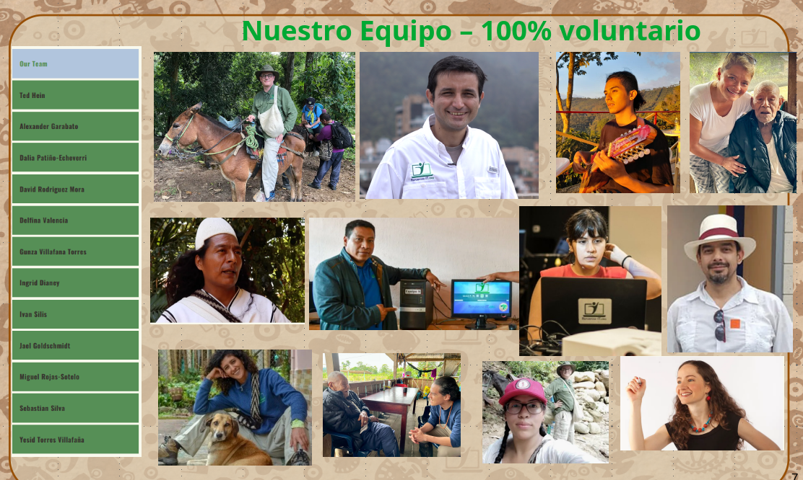

## {autoslide=4000}

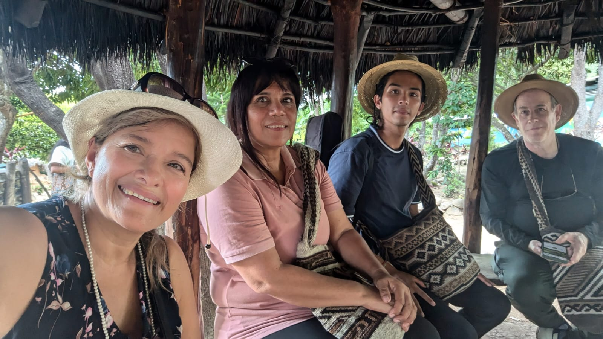

## {autoslide=4000}

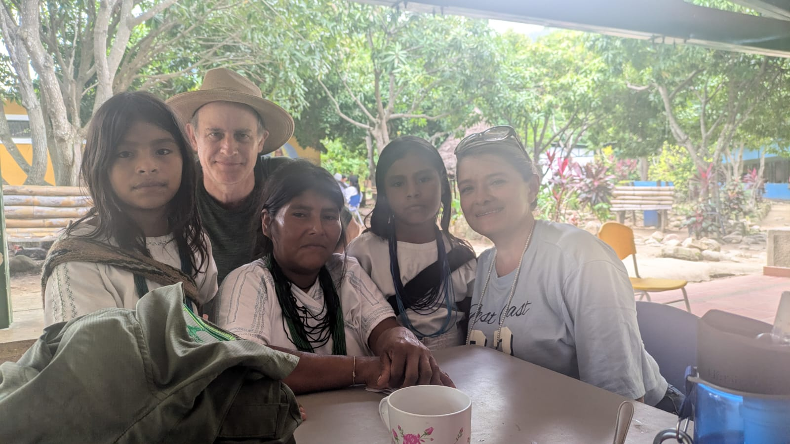

## {autoslide=4000}

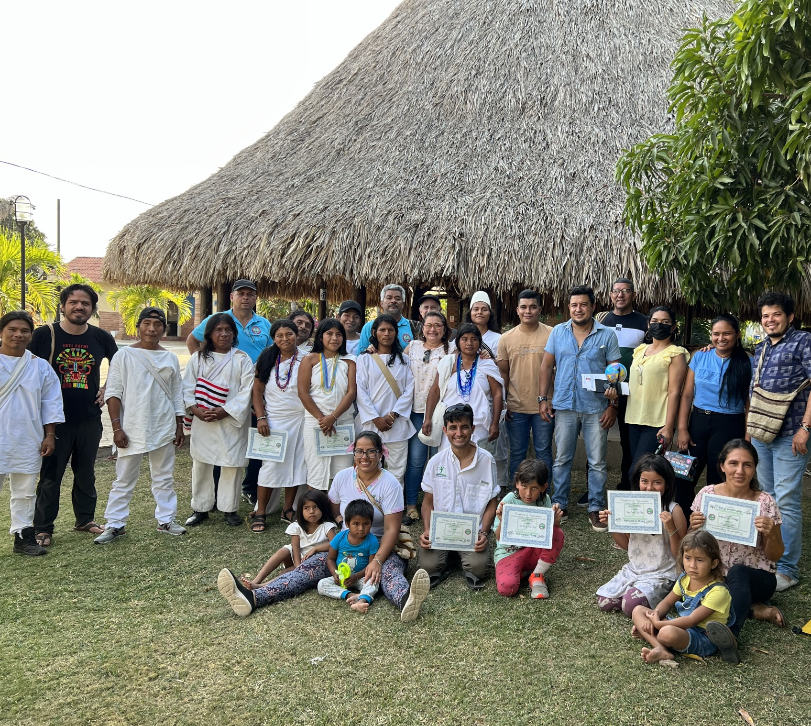

## {autoslide=4000}

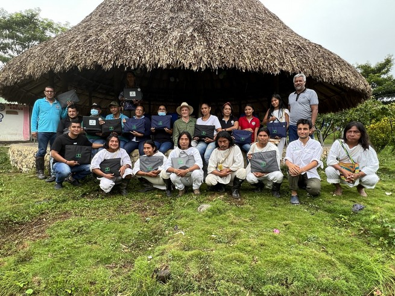

## {autoslide=4000}

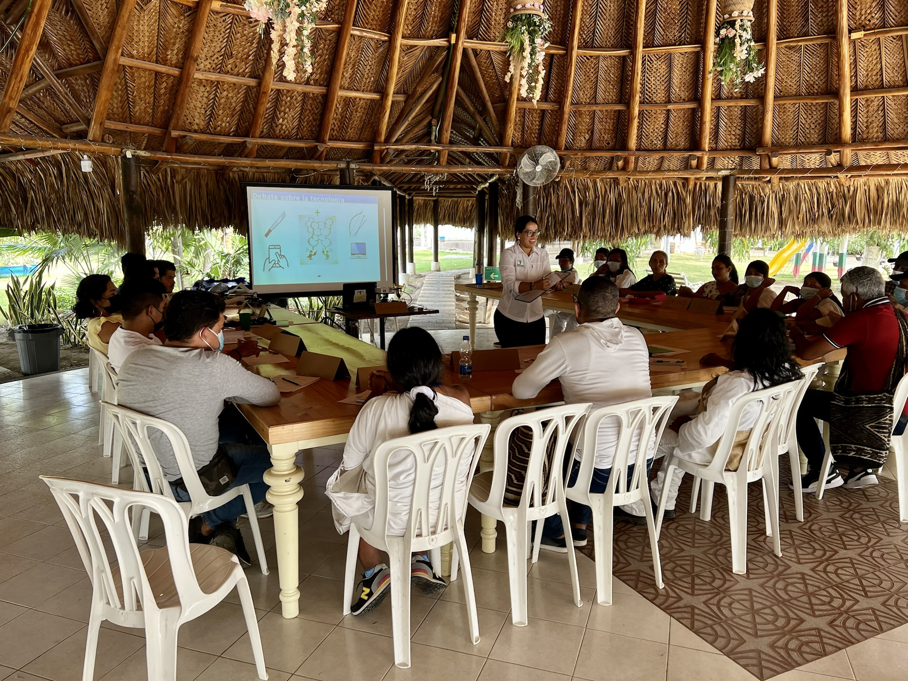

## {autoslide=4000}

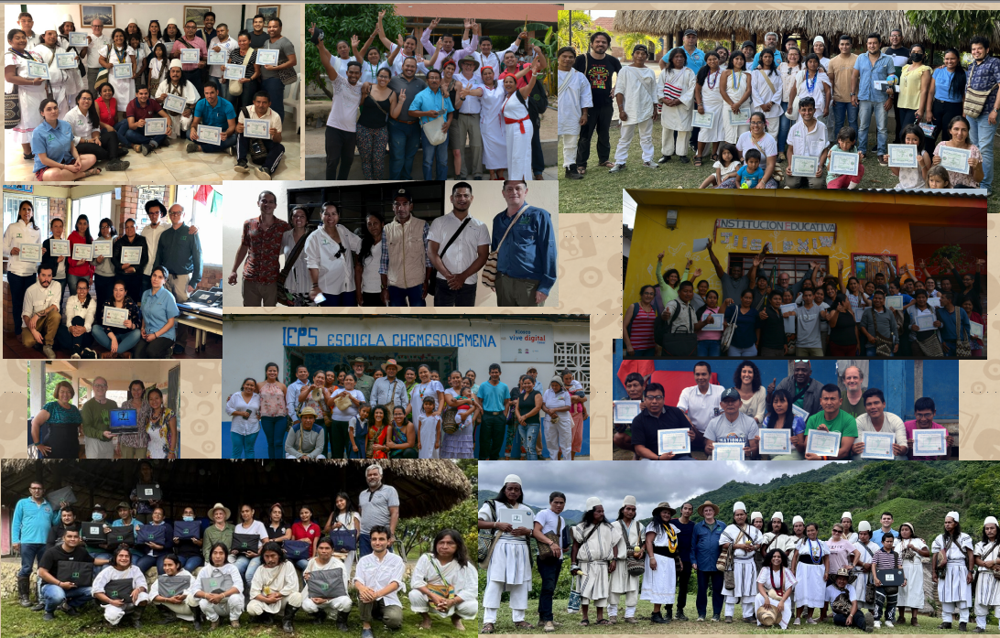

## Gracias - Thank you - Duni {.nostretch}

### sebastian@fuentelibre.org - @icarito_libre

::: {.column}

{height=300px}

:::

::: {.column}

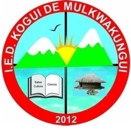{height=300px}

:::

26 de Junio de 2025 - Santa Marta, Colombia
